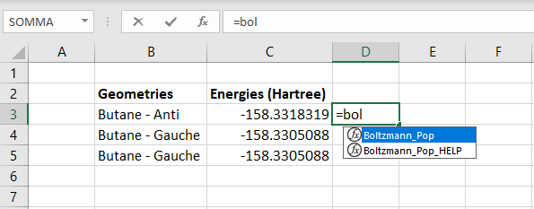
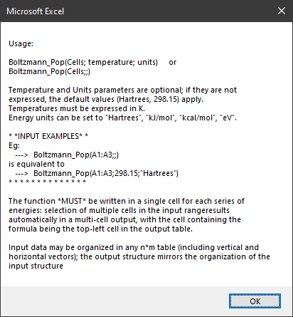
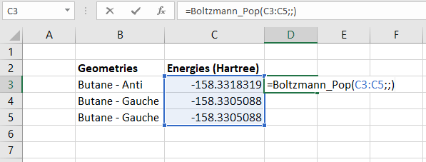
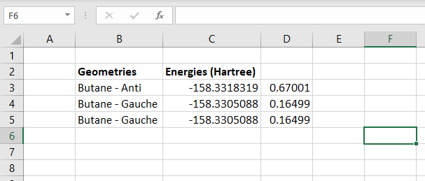
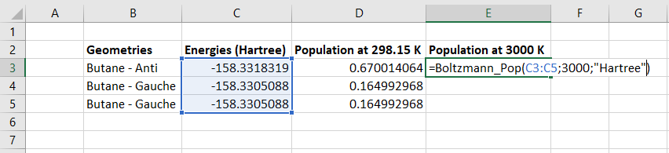
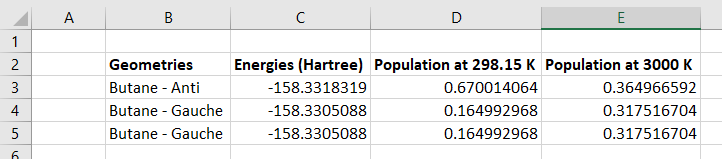

## What is this?
Just a simple excel function (an UDF, User Defined Function) which allows calculating the Boltzmann population of several energy levels (eg: conformers, spin states, etc).

Once installed, the function can be called just like any other excel function, by typing *"=Function_Name"*; in this case, *"=Boltzmann_Pop("*

The code is mainly intended for use with computational chemistry packages, hence the **default energy units** are **Hartrees** (a.u.), but **kJ/mol**, **kcal/mol**, **eV** can be set easily.
The default temperature is **298.15** K, but other temperatures can be set easily.

## Installation
The function is contained in the Boltzmann_Pop.xlam file.

In Windows, all you have to do is:
1. Download the file **Boltzmann_Pop.xlam**
2. Right click on it > Properties; check the "Unblock" box and press OK
3. Copy the file in %APPDATA%\Microsoft\AddIns (it equals C:\Users\username\AppData\Roaming\Microsoft\AddIns)
4. Open Excel, go to Options > Add-ins > Go... 
5. Check Boltzmann_Pop ad press OK
6. Done! :)

Exhaustive instructions on installing these files can be found online, eg:

https://www.automateexcel.com/vba/install-add-in

https://support.microsoft.com/en-us/office/add-or-remove-add-ins-in-excel-0af570c4-5cf3-4fa9-9b88-403625a0b460

## Some examples
We calculated the energies of the three low-energy conformations of butane: two isoenergetic *gauche* and a *trans* conformer.
We want to know how populated those conformations are at room temperature.
The energies reported here are in Hartree, so the "energy" parameter can be omitted, as Hartrees are set as default energy units.
In order to calculate the population at 298.15 K, we start by typing the formula:
*=Boltzmann_Pop(*

Note that, while typing, a **HELP function** is displayed. This can be executed if the command syntax is forgotten: the "Help" function displays the following informative window.

By typing
*=Boltzmann_Pop(Range;;)*
which is equivalent to:
*=Boltzmann_Pop(Range;298.15;"Hartrees")*...

...the populations of the energy levels in the input range is displayed.
The obtained values state that at room temperature (in the gas phase) 67% of butane molecules are in *Anti* conformation, and the remaining 33% is in two isoenergetic (ie symmetric, degenerate) *"Gauche"* conformations

By typing in another cell the command
*=Boltzmann_Pop(Range;3000;"Hartrees")*
the same calculation is performed at a higher temperature (3000 K).
We see that at 3000 K, only 36% of butane molecules are in Anti conformation, and 64% of butane molecules are in Gauche conformations.

## Some notes
As you can easily guess from the source code, the main user-specified options are regarding the energy units.
A bit of typing freedom is tolerated:
- The keywords  "Hartree", "hartree", "Hartrees", "hartrees", "Eh", "eh", "au", "a.u." **set units to Hartrees**
- "kJ/mol", "kj/mol", "kj\mol", "kJ\mol", "kjmol", "KJ/mol" **set units to kJ/mol** 
- "kcal/mol", "Kcal/mol", "kcalmol", "kcal\mol", "Kcal\mol" **set units to kcal/mol**
- "ev", "eV", "EV"  **set units to eV**

## About energy units
The following definitions are considered in setting the values of kB:

![equation](https://latex.codecogs.com/gif.image?%5Cdpi%7B110%7D%20%5Cbg_white%20%5Cbegin%7Balign*%7D%20%20k__%7BB%7D=1.380649%5Ctimes%2010%5E%7B-23%7D%20%5C%20J/K%20%5Cmathit%7B%5C%20%5C%20%5Cxleftarrow%5B%5D%7B%7D%5C%20exact%5C%20by%5C%20definition%7D%20%5C%5C%20N__%7BA%7D=6.02214076%5Ctimes%2010%5E%7B23%7D%20%5Cmathit%7B%5C%20%5C%20%5Cxleftarrow%5B%5D%7B%7D%5C%20exact%5C%20by%5C%20definition%7D%20%5C%5C%201%20%5C%20cal%20=%204.184%20%5C%20J%20%20%5Cmathit%7B%5C%20%5C%20%5Cxleftarrow%5B%5D%7B%7D%5C%20exact%5C%20by%5C%20definition%7D%20%5C%5C%201%20%5C%20eV%20=%201.602176634%5Ctimes%2010%5E%7B-19%7D%20%5C%20J%20%20%5Cmathit%7B%5C%20%5C%20%5Cxleftarrow%5B%5D%7B%7D%5C%20exact%5C%20by%5C%20definition%7D%20%5C%5C%201%20%5C%20%20E__%7BH%7D%20=%204.3597447222071%5Ctimes%2010%5E%7B-18%7D%20%5C%20J%20%5C%5C%20%5C%5C%20k__%7BB%7D=3.16681156345561%5Ctimes%2010%5E%7B-6%7D%5C%20%20E__%7BH%7D%20%5C%5C%20k__%7BB%7D=8.31446261815324%5Ctimes%2010%5E%7B-3%7D%5C%20%20%5Cfrac%7BkJ%7D%7Bmol*K%7D%20%5C%5C%20k__%7BB%7D=1.98720425864083%5Ctimes%2010%5E%7B-3%7D%5C%20%20%5Cfrac%7Bkcal%7D%7Bmol*K%7D%20%5C%5C%20k__%7BB%7D=8.61733326214518%5Ctimes%2010%5E%7B-5%7D%5C%20%20%5Cfrac%7BeV%7D%7BK%7D%20%5Cend%7Balign*%7D)

*Written by Vincenzo Brancaccio, 2020.
 You are free to share, edit, copy, improve or break this code!*
